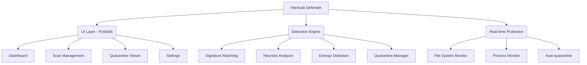
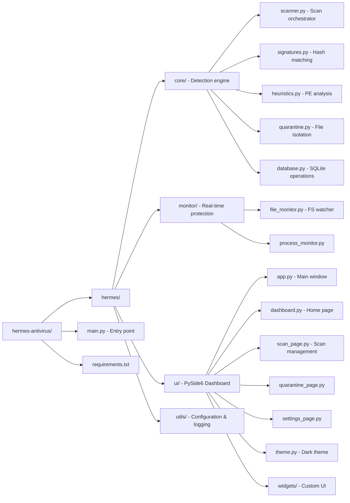

# 🔒 Interlude Defender

**Next-Generation Threat Detection — Lightweight, Intelligent, Non-Intrusive**

> The best antivirus is one you don't notice is running.

---

## ✨ Features

- **🪶 Lightweight** — ~80-120 MB footprint, <2% CPU at idle
- **🤫 Silent** — Background operation, alerts only on ACTUAL threats
- **🧠 Intelligent** — Heuristic analysis + behavioral detection + signature matching
- **⚡ Fast** — Multi-threaded scanning, Bloom filter lookups in O(1)
- **🛡️ Trust-First** — No subscriptions, no dark patterns, no nagware
- **🔍 Transparent** — Open-source threat definitions

## 🏗️ Architecture



## 🚀 Quick Start

### Releases
-Download the latest release from [Github](https://github.com/Hndrd0/Interlude-Defender/releases/tag/v.0.0.1)

### Installation

```bash
# Clone the repository
git clone https://github.com/Hndrd0/Interlude-Defender.git
cd Interlude-Defender

# Install dependencies
pip install -r requirements.txt

# Launch the dashboard
python main.py
```

### CLI Mode

```bash
# Quick scan (temp folders, downloads, startup)
python main.py --scan

# Full system scan
python main.py --full-scan

# Scan a specific directory
python main.py --scan-path "C:\Users\YourName\Downloads"

# Start in background (tray only)
python main.py --background

# Debug mode
python main.py --debug
```

## 🎯 Detection Layers

| Layer | Method | Speed | Purpose |
|-------|--------|-------|---------|
| **1** | SHA256 Signature Matching | <1ms/file | Catch known malware |
| **2** | PE Heuristic Analysis | <50ms/file | Catch variants & obfuscated threats |
| **3** | Entropy Detection | <10ms/file | Detect packed/encrypted executables |
| **4** | Import Analysis | <20ms/file | Flag suspicious API usage patterns |

## 🎨 UI Design

- **Dark glassmorphic theme** — Premium look, easy on the eyes
- **Zero dark patterns** — No fake warnings, no upsell, no nag screens
- **Minimal notifications** — Only alerts on real threats
- **System tray integration** — Runs silently in the background

## 📁 Project Structure



## 🔒 Philosophy

Every antivirus company optimizes for **upsell revenue**. Interlude optimizes for **actual protection**.

- ❌ No fake "warnings" to scare you
- ❌ No "upgrade to Pro" nags
- ❌ No subscription reminders
- ❌ No upselling additional products
- ❌ No slow-down tricks

## 📜 License

MIT License — Free to use, modify, and distribute.

---

**Built with ❤️ by Interlude Security**
